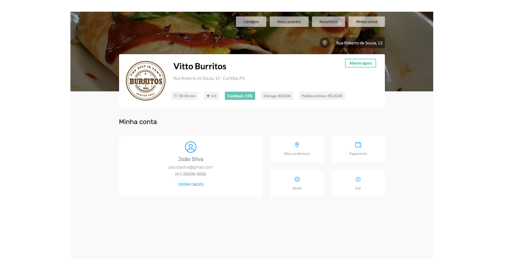
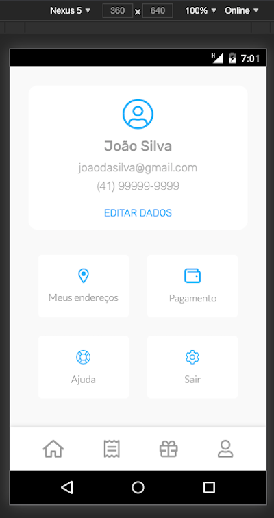
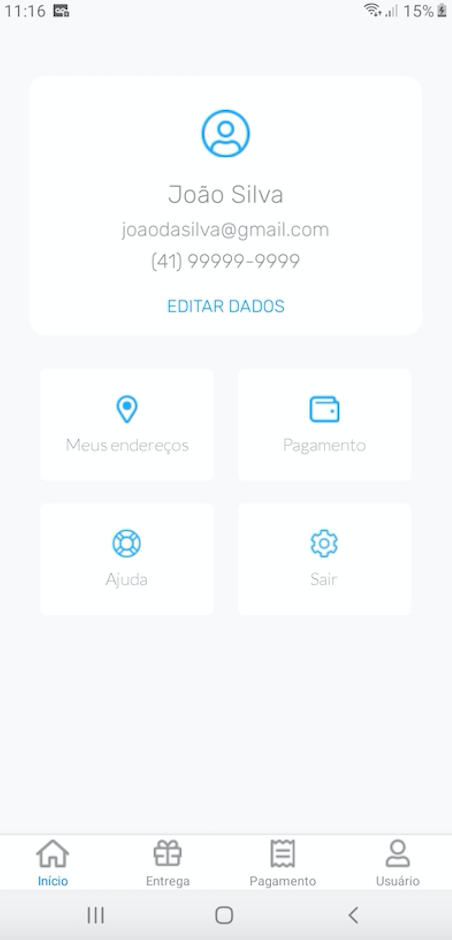

<h1>O Desafio foi feito em três perspectivas diferentes:</h1>

<li>1 - HTML e CCS "puros" com a versão Desktop e a versão responsiva. Para ter um melhor aproveitamento, é necessário inspecionar elemento e escolher um dispositivo móvel em vez de apenas ir reduzindo a resolução.</li>

 
 

###Instalação: é só abrir o index.html

<li>2 - ReactJS: aparência idêntica à versão de HTML E CSS puros. Porém, com framework REACTJS que proporciona uma gama de possibilidades, tais como integração de apis e componentização.</li>

###Instalação: rode o comando yarn ou npm install para instalar a dependências necessárias.
###Para rodar, é só rodar o comando npm start ou yarn start

<li>3 - Mobile App com React Native: idêntico à versão responsiva do HTML E CSS puros, porém, é um aplicativo nativo que pode ser baixado e instalado no seu dispositivo Android.</li>
 
 

###Instalação: rode o comando yarn ou npm install para instalar a dependências necessárias.
###Para rodar, é só rodar o comando:

para IOS: npm run ios ou yarn run ios

Para Android: npm run android ou yarn run android

Link do apk: https://drive.google.com/file/d/1H-oXuLomNmtEdldCZBxpSb3vZQ8om01x/view?usp=sharing

Gostou? Visita meu portfólio: https://portfolio.hellostudio.com.br/
